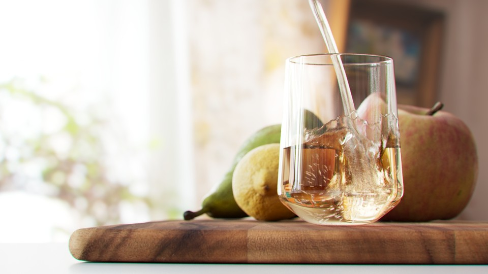
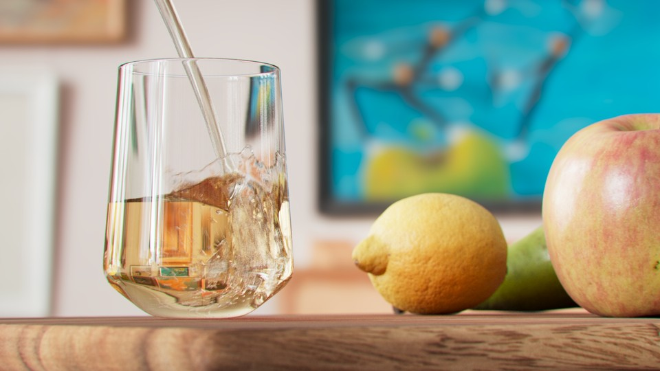



In this project I wanted to learn more about Flip simulations in Houdini. I am using the SOP Flip workflow and I must say that I really like it, quite quick and intuitive to setup. The glass is modeled in Houdini based on the Essence tumbler by Iittala. The fruit and woodboard are Megascans. Rendered in Houdini using Karma XPU. Next steps are exploring ways to add art directable bubbles at intersection of the fluid and glass and improving the shape of the fluid.

