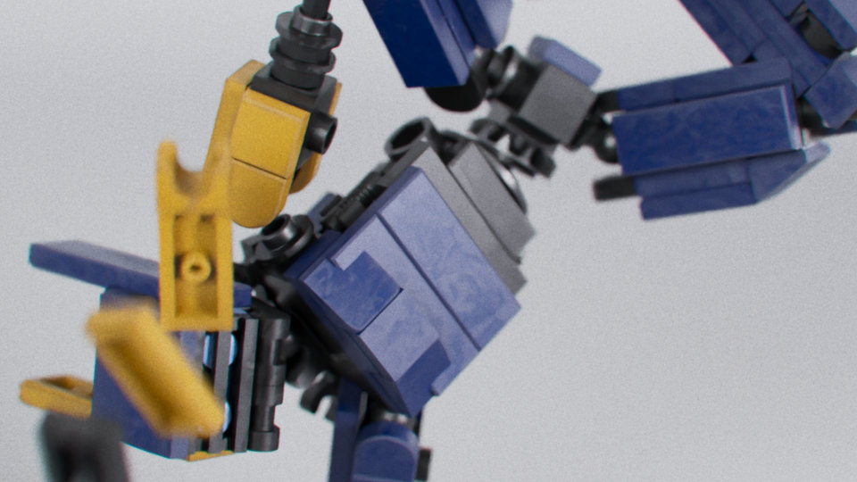



The model was animated using mocap retargeting with KineFX in Houdini. The animation (both the character and cameras) was then exported to a custom format and imported to Unreal Engine 5.3 using pipeline tools that I am developing. The sequence was rendered using the Path Tracer in UE and comped and graded in DaVinci Resolve.



Houdini project. Exploring KineFX (procedural rigging and animation framework), rigid body dynamics and Solaris (scene building, layout, lighting, and rendering tools based on the USD framework)

Lego model from: [Mecabricks](https://www.mecabricks.com/en/models/Jk2E8K7Ka9A)  
Mocap from: [Mixamo](https://www.mixamo.com/#/?limit=96&page=1&query=breakdance&type=Motion%2CMotionPack)

