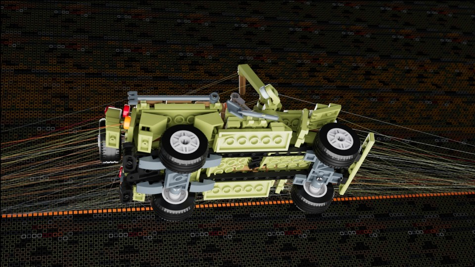
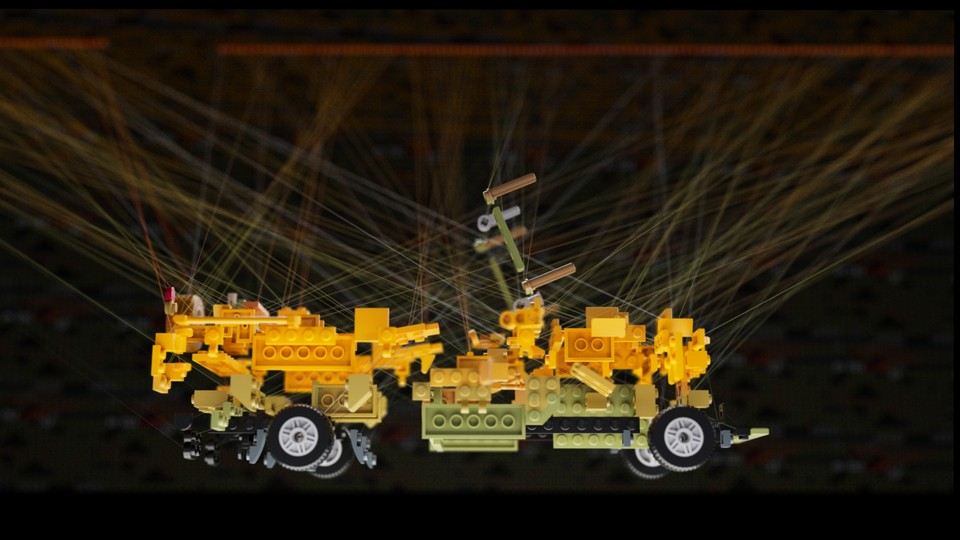
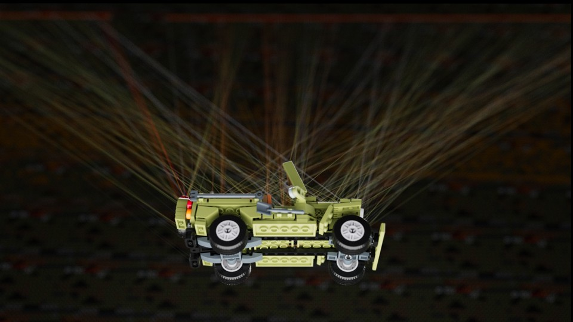



In a previous project I explored Vertex Animation Textures (VAT). In short VAT is a way to animate meshes on the GPU, using only textures, shaders and data stored on the mesh as vertex colors and custom uv channels. In this project I wanted to visualize the texture being sampled and the resulting animation. The position, orientation and colors are driven by the textures. The grid in the background visualizes the pixels in the texture and the moving section are the pixels currently being sampled. A line is drawn between the currently sampled pixels and the corresponding pieces of the mesh. The project is made in Houdini and rendered using Karma XPU.

Lego model: n1LS on mecabricks.com

