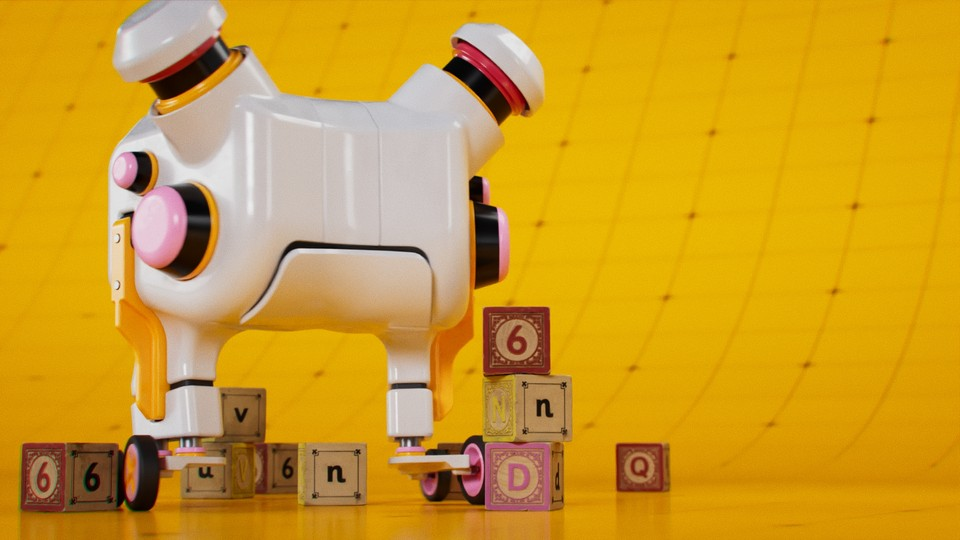
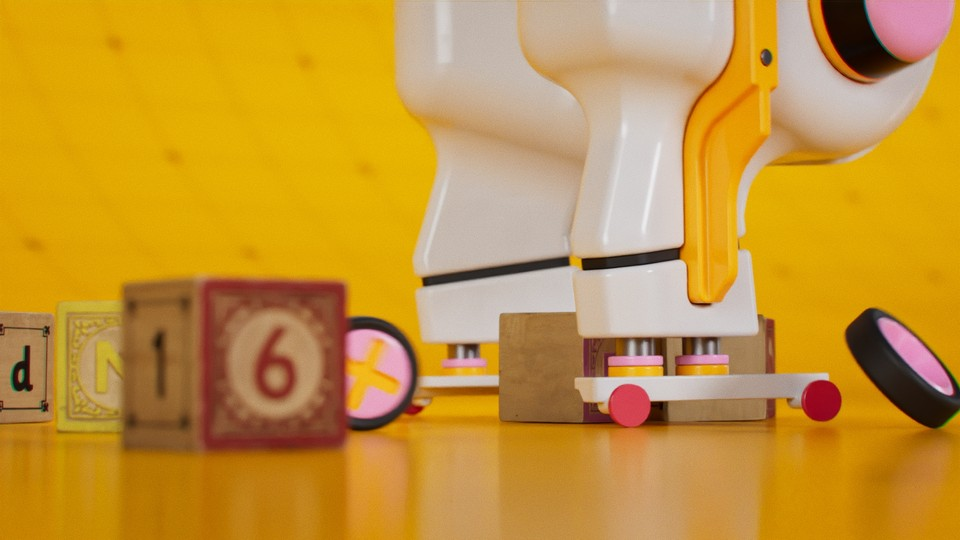
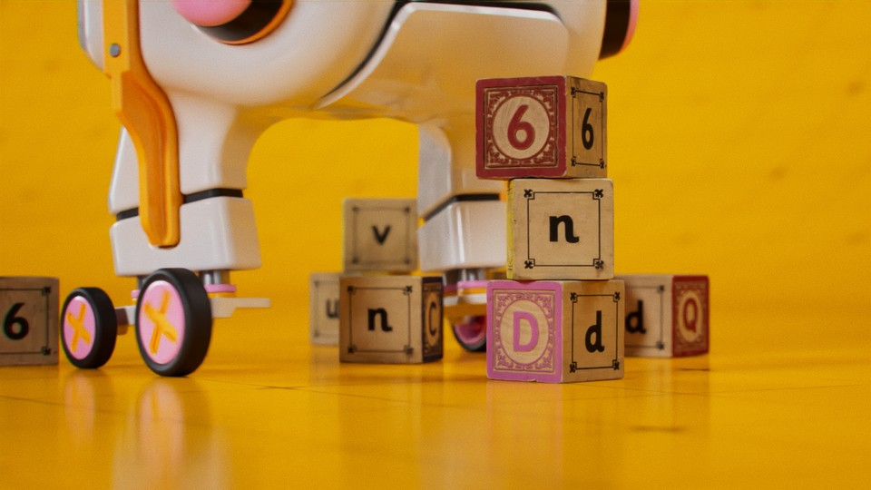



Houdini experiment using RBD, rendered with Karma XPU with low samples and denoiser. The robot is modelled in Plasticity and the wooden toys are Megascans.

The wheels are using cone twist constraints and I am using a motor per wheel to drive the robot.

Music: Ping Pong, You Know? by Six Umbrella

